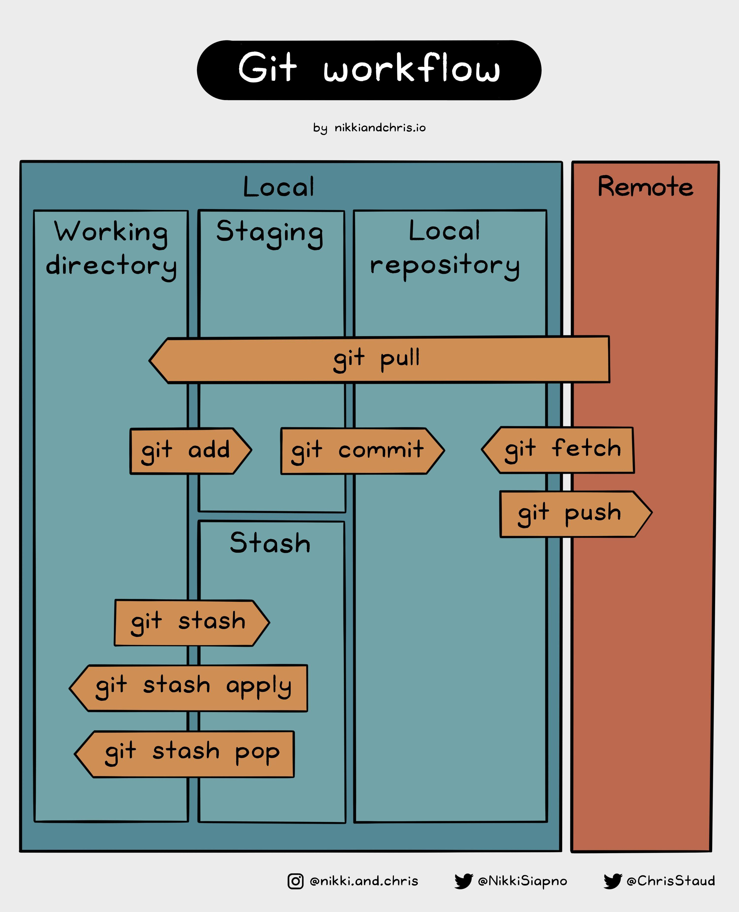

# MSSE-640
Types of Version Control Systems
	Centralized Version Control Systems (CVCS)
	Distributes Version Control Systems (DVCS)

	Git is a DVCS

Snapshot
	The state of your entire project at a specific point in time. When using the “git commit” 	command, Git takes a “picture” of all of the files in your project and records it as a snapshot. 

What is a repository? Remote vs. Local?
	A repository is a place where you store all of your code, files, and the revision history of each file. The revision history also typically contains comments and notes on what has changed at each commit. Repositories can have a single collaborator or multiple. A local repository is stored on your PC. A remote repository is stored on GitHub.

What is a commit?
	A commit is how someone saves the changes someone has made to one or more of the files in a repository. Each commit includes information on the changes that were made. This information is included by whoever is making the commit.

What is working directory?
	The explanation for working directory is still a bit confusing to me. However, below is a summarization of explanations that I have found.

	The working directory represents the contents of your project folder. It is a sort of “workbench” where you can edit, add, and delete files. After working on your project in the working directory, using the “git add” command then stores the pending changes in the staging area before pushing these changes to your local repository.

What is Staging Area?
	The staging area is the space between the working directory and one’s local repository where a developers work can checked and confirmed before being saves in the local repository.

Find a good diagram that illustrates the architecture and the flow.
	
